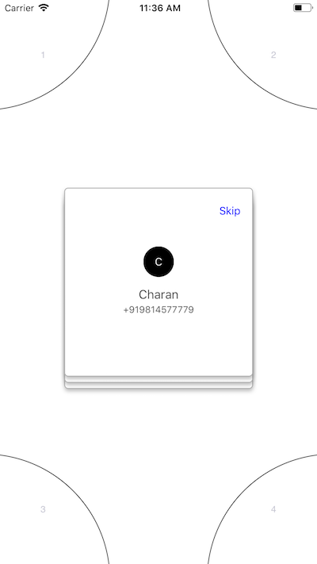
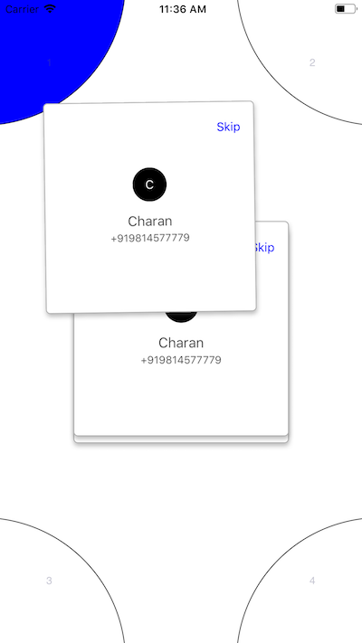
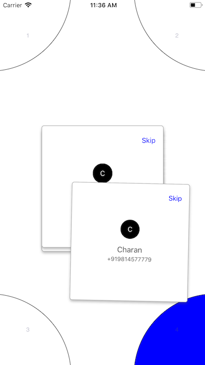

# CSSwipableToCorners
loadCardValues() // Load cards after maintain array of objects i.e. arrPhoneContacts of class Model.

//Delegate method call on swipe each card

func cardGoes(card: Card,obj:Model) {

        removeObjectAndAddNewValues()
        if card.dropCardNo < 5{
            print(card.dropCardNo)
        }else{
            print("Skiped")
        }
    }
    
// Make modifications in card here in this method 

private func setupView(_ obj:Model)

